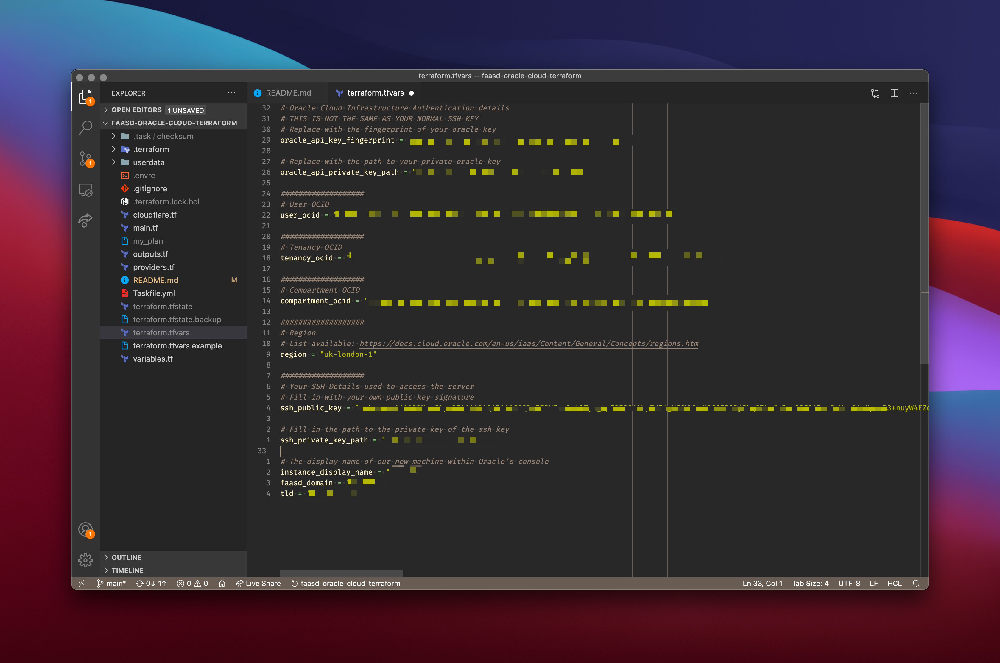
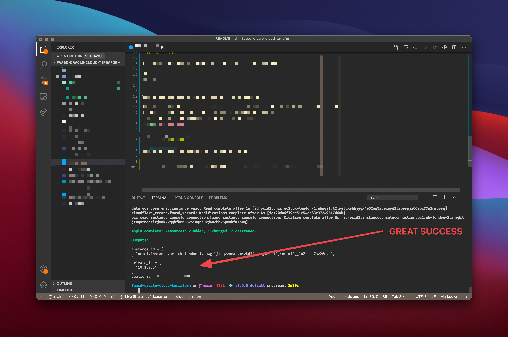
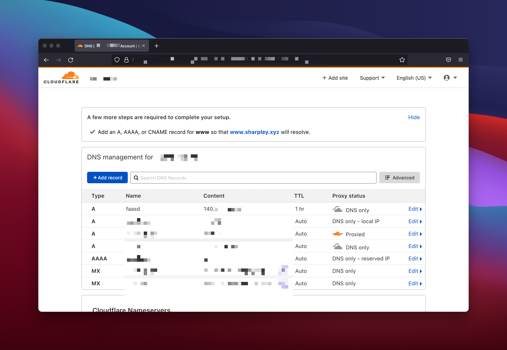

# faasd-oracle-cloud-terraform
Faasd with HTTPS on Oracle Cloud using Terraform and CLOUDFLARE in just five minutes<sup>[1](#myfootnote1)</sup>!

# What is this?
A project to standup an always free FAASD instance on public cloud. This runs entirely
within the Oracle Cloud free tier. So if you are like me, and already have a domain name
or two floating around then this is Free FaaS - FFaaS.

This will use Terraform to create you a single FAASD instance, HTTPS cert and DNS entry
in cloudflare.
# Prerequisites

We need a few things to get going...
## Software

* [Terraform](https://www.terraform.io/downloads.html)
* [TaskFile](https://taskfile.dev/#/) - used to wrap tasks. 

If you are on MacOS and have brew:

```
brew install go-task/tap/go-task
brew install terraform
```

## Other bits

* An SSH key
* A domain Name

* Oracle Cloud Account
* CloudFlare Account

## Get going

# Configure your terraform variables

You may run `task setup` to template out a terraform.tfvars file.

In here you need to specifiy your variables for Oracle Cloud, Cloudflare and your domain
name.
To configure the Oracle OCI Terraform provider follow the guides on [their website](https://docs.oracle.com/en-us/iaas/Content/API/SDKDocs/terraformgettingstarted.htm#Getting_Started_with_the_Terraform_Provider)

Note if you are doing this for the first time time then configuring your oracle cloud
may be a bit tricky.

Some guides:
* [Official Oracle Docs
](https://docs.oracle.com/en-us/iaas/developer-tutorials/tutorials/tf-provider/01-summary.htm)
* [Blog post by Maarten Mulders](https://maarten.mulders.it/2020/06/infrastructure-as-code-with-terraform/
)

For cloudflare use [this guide](https://registry.terraform.io/providers/cloudflare/cloudflare/latest/docs).
Note your domain name will need to using their DNS.

At the end of this your terraform.tfvars should look something like this (just less pixelated):

Note I've moved some vars out of this file and into a file called .envrc (I use
[direnv](https://direnv.net/) to help manage my variables). This is an entirely optional
and you may keep those variables in your `terraform.tfvars`.

# Let's do this

Once your variables are in place we are ready to rock and roll.

```
task apply
```
A successful output will look like the below:



Wait a few minutes (4.5 minutes, actually) for cloud init to do it's thing...

Once this completes you will have an always free faasd instance in Oracle Cloud, new DNS
entry in Cloudflare and a sense of pride in your achievements.

Your Cloudflare DNS should look something like this:


## Troubleshooting
If your instance is up but you cannot access your service via HTTPS then it's most
likely that cloud init is still running - this can take some time to complete.

Run `task login` to access your instance via SSH.

Useful commands once you are logged in:
```
# follow cloud init
tail -f /var/log/cloud-init-output.log

# Check status with:
sudo journalctl -u faasd --lines 100 -f

# Login with:
sudo cat /var/lib/faasd/secrets/basic-auth-password | faas-cli login -s

```


<a name="myfootnote1">1</a>: Five minutes once you've configured your oracle account, cloudflare account and populated your terraform variables :)